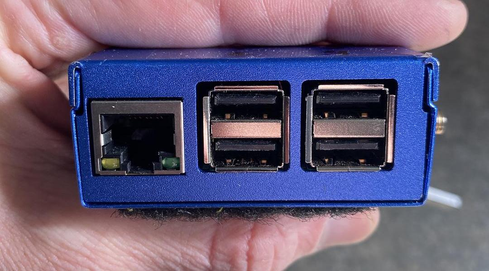
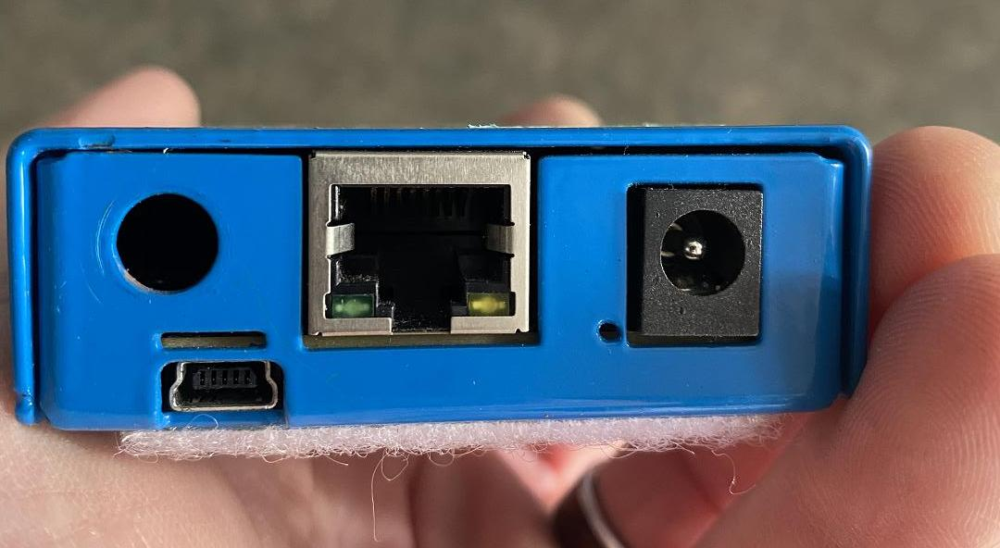
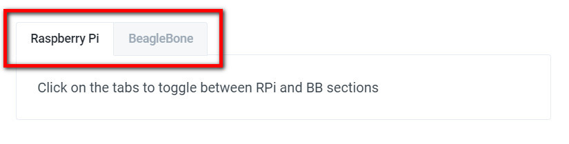

# Introduction and Overview

## What is a SensorGnome?

A SensorGnome is an automated radio receiver, designed to detect and record radio signals transmitted by wildlife tracking tags, without the need for any person to be present.

At its core, a SensorGnome is powered by a mini computer – either a **Raspberry Pi** or a **BeagleBone**. The mini computer runs the software that listens for and records the radio data picked up by the antennas.


Throughout this document, we will often refer to a SensorGnome as an **SG**, and to the Raspberry Pi and BeagleBone as **RPi** and **BB,** respectively. For instance, a SensorGnome powered by a Raspberry Pi will be referred to as an **RPi SG.** 


In addition to the mini computer, the SG will include one or more “software-defined radios” which come in the form of a USB dongle. The dongles are the devices that take the raw radio signals from the antennas and convert it into a digital format that can be recognized and recorded by the RPi or SG computer.

The most commonly used dongle is the “FUNcube dongle,” and you will often hear all dongles simply referred to as “FUNcubes.” There will be one dongle for each antenna connected to the SG. The dongles, as with the antennas themselves, are specific to the frequency of the tags being detected: Lotek tags \(166, 150.1, or 151 MHz for Lotek nanotags depending on the geographic region; or 434 MHz for CTT tags worldwide\).

The SensorGnome will also include a GPS and various wires related to the power supply. All of this hardware is then typically housed in a heavy-duty Pelican case.

###  What kind of SensorGnome do I have?

The BeagleBone and Raspberry Pi computers may be housed in a variety of cases that may have different colours and labels on them. However they are easily differentiated by the ports that they have, as shown in the images below. For a more detailed overview of the physical differences, refer to the Appendix.

A **Raspberry Pi** \(below\) has one Ethernet port on the left, with **4 standard USB ports** to the right of the Ethernet port.

A **BeagleBone** \(below\) has one Ethernet port in the centre flanked by a Mini USB port on its left, and a circular “barrel jack” on its right. The circular hole above the Mini USB port on the left hand side is a feature of this particular case; some cases will not have a hole here.

_Note: there are two other receivers compatible with the Motus network: the SensorStation made by Cellular Tracking Technologies \(CTT\) and the SRX receivers made by Lotek. For guides on how to use these receivers, please consult CTT or Lotek respectively._

## Overview of typical workflow

Generally each time you work with a SensorGnome – either deployed in the field or as a test on your desktop – you will perform the same basic steps below. 

1. Connect to the SensorGnome
2. Open the Web Interface to check the SGs initial status
3. Establish an FTP connection to download detection data or modify configuration files
4. Confirm status once again on the Web Interface \(and take a photo or screenshot\)
5. Disconnect from the SensorGnome

There are many similarities between Raspberry Pi and BeagleBone based SensorGnomes – in terms of the hardware, the software that powers them, and the process of using them typically follows the same outline. But there are also some key differences, particularly as it relates to the method of connecting to them and transferring data. 

The steps above are described in detail in this guide, with an effort to presenting the commonalities between them. Where differences are found between RPi and BB SensorGnomes, they will be broken down into sub-sections.

