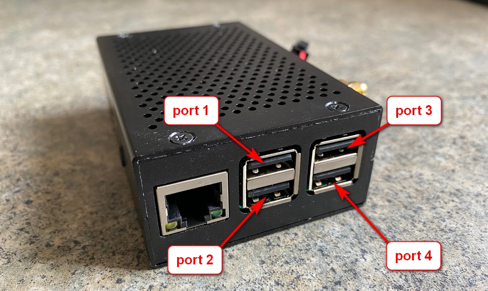
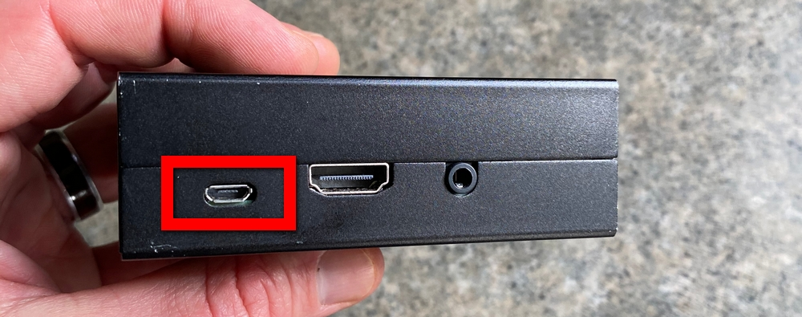
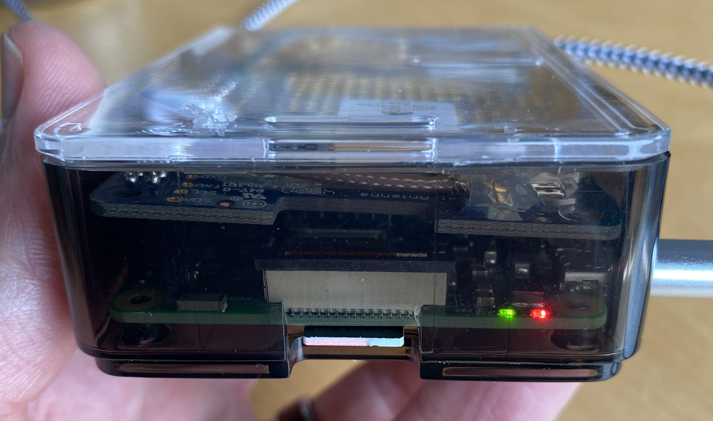
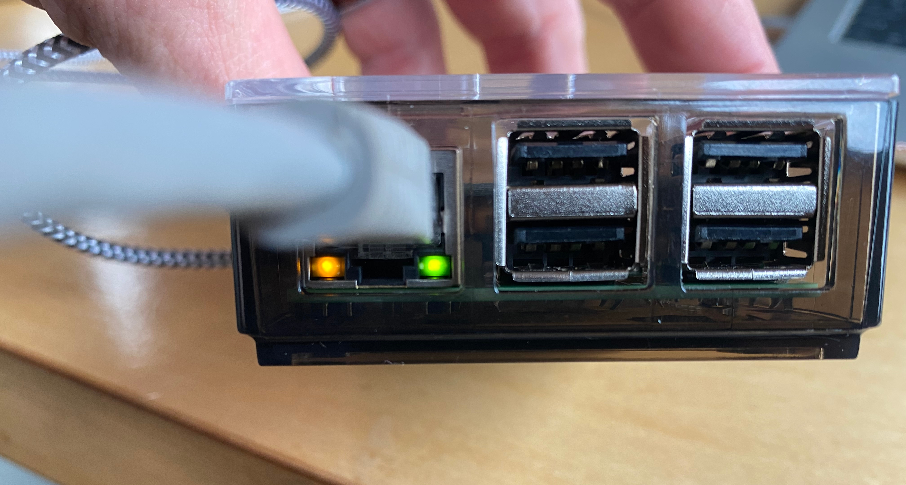
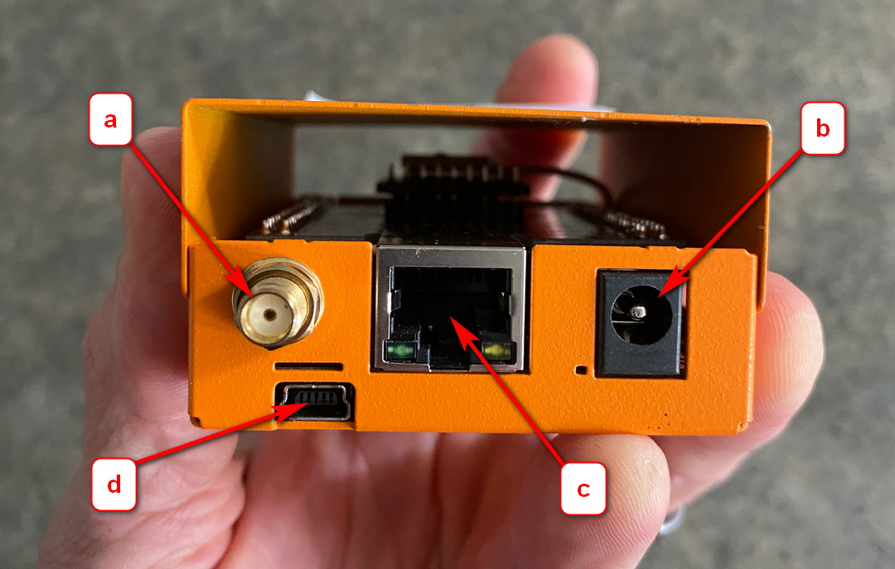

# Anatomy of a SensorGnome

## What's inside a SensorGnome?

Both RPi and BB SensorGnome consists of the same core components:

* Raspberry Pi or BeagleBone mini computer. This runs the software that records the raw radio pulse data.
* FUNcube USB dongles or other "software defined radios". These take the analog radio signals coming from the antennas and convert them into a digital format 
* GPS. This records the precise location of the SG, as well as ensures the the precise time is always set on the SensorGnome
* Associated power supply 

## Raspberry Pi SensorGnome

### Raspberry Pi

#### Ports and slots 

The numbering of the USB ports is very important when attaching antennas since this information is recording along with detection data and can be used to determine the direction and time of approach or departure of a tagged animal.

The MicroSD card slot is on the opposite side as the USB and Ethernet Ports. The card is inserted with the contacts facing up, and there is no click or other indicator when the card is inserted. On some cases the the MicroSD is so deeply recessed that it cannot be removed without tweezers.

Power is supplied to a RPi through the Micro USB port. This port only supplies power and is not used to communicate with a computer. 

#### Lights 

LED lights can be useful in determining if the unit has power and if it is functioning properly. The RPi has fewer lights and they are less information than a BeagleBone, but they can still be helpful.


There are many different cases used to house the Raspberry Pi. Not all of them permit a clear view of the lights.


The RPi itself has only two primary LED lights -- one red and one green. These are visible on the bottom right hand corner of the side that hosts the MicroSD slot. The red light indicates power, while the green light indicates CPU activity. The red light should always be on if sufficient is supplied, whereas the green light will flash sporadically

The attached GPS had also has an indicator light, in this case a red LED. It does not light up consistently but instead blinks occasionally.

Lastly, there are two indicator lights on the bottom of the Ethernet port. When the Ethernet cable is attached to a computer these lights should be on or flashing consistently.

### GPS 

### Fully assembled RPi SensorGnome

**a\)** The Raspberry Pi. The colour of the RPi case may vary between SG’s but they will also be roughly the same size

**b\)** Two FunCUBE Dongles. A Raspberry Pi SG can accommodate up to 4 dongles plugged directly into the RPi. In order to accommodate additional antennas, a USB hub would be required. The cables from the antennas will plug into the free end of the dongles.

**c\)** This is the inside view of the button used to activate the WiFi hotspot.

**d\)** GPS antenna. When deployed in the field, this end of the antenna would be outside the SG case, and attached to something that had a clear view of the sky. The other end is attached to the Raspberry Pi by way of the gold-coloured “SMA” port on the top right corner of this particular RPi.

**e\)** Voltage converter. If powered by a solar panel and battery, as this SG is, the power coming in will be 12V. However the RPi only requires 5V, so a voltage converter is used to downgrade the current to the acceptable level. If powered directly by AC power, the wall adapter itself should output 5V, eliminating the need for a voltage converter.

## BeagleBone SensorGnome

### BeagleBone

#### Ports and slots

**a\)** SMA port for attaching GPS antenna. This particular BeagleBone is outfitted with an integrated "GPS hat" and requires an external antenna. Some older BeagleBones lack an integrated GPS and will not have this port 

**b\)** 5V barrel jack port. This is where the primary power supply is plugged in when deployed in the field

**c\)** Ethernet port. Most often used for automatic syncing of detection data to the Motus server.

**d\)** Mini USB port. This is the main port used to connect a BB to your computer. It also supplies enough power to power the BB on its own if needed

**a\)** Standard USB port. Typically the USB Hub will be attached here as the BB only has one standard USB port. FUNcubes and other dongles are then plugged in to the USB hub. This port is not used for communication between the computer and BB.

**b\)** MicroSD card slot. In the BB the card is inserted with the contacts facing down, and there is a slight click when properly inserted.

#### Lights

### GPS

### Fully assembled BB SensorGnome

**a\)** BeagleBone mini computer. The colour of the case may vary but it will always be roughly the same size.

**b\)** GPS antenna. This BB has a "GPS hat" attached to the BeagleBone itself, and only requires an external antenna. Many BB last the integrated GPS and require a USB GPS, which is plugged into the USB hub

**c\)** FUNcube dongles plugged into ports 1 and 2 of the USB hub. The antenna cables would be attached to the loose ends. Note that the antennas must be plugged into a USB hub as the BB only has one standard USB port.

**d\)** USB hub. The USB hub is supplied with power by via a splitter coming from the main power source, with the other end supplying the BeagleBone. It is attached to the BB's only standard USB port.

**e\)** Voltage converter and cable junction. If powered by a solar panel and battery, as this SG is, the power coming in will be 12V. However the RPi only requires 5V, so a voltage converter is used to downgrade the current to the acceptable level. If powered directly by AC power, the wall adapter itself should output 5V, eliminating the need for a voltage converter.


Pay close attention to which ports on the USB hub you attach the dongles to. The port number is recorded along with the detection data and is used in determining the direction of the animals detected. The ports on the USB hub are labelled 1 through 7. If the label is missing, you can determine the numbering based on their position relative to the USB and power supply. 


The 7 USB ports on the hub can all be used to attach dongles to, but pay close attention to the number of each port and the antenna attached to it. The USB hub is supplied with 5V power, usually by way of a splitter \(with the other end supplying the BB with power\). It is attached to the BB with a standard [USB A &gt;  USB B cable](https://www.bhphotovideo.com/images/images2500x2500/Pearstone_USB_AB10_USB_2_0_Type_A_689978.jpg). 

