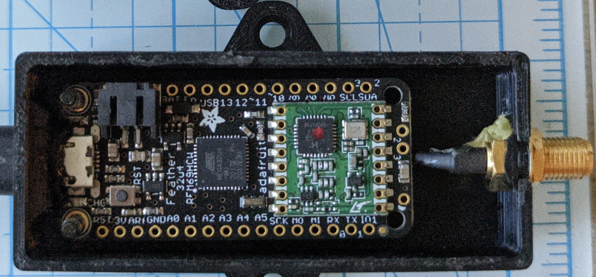

# CTT Motus receiver dongles for 434 MHz (dual-mode) capability on SensorGnome

Once you have the SensorGnome loaded with the necessary software to detect CTT LifeTags/ PowerTags (i.e., it's "dual-mode"), you will require a USB receiver dongle for each antenna listening at 434 MHz. These are often referred to as "CTT Motus dongles." &#x20;


_CTT stopped manufacturing these dongles in early 2023. However, they have generously provided the firmware and 3D printing schematics that make it possible to build and assemble your own. Below we provide the necessary components and general steps, which we will expand on in the near future._


**1)** Acquire the necessary components and files

* [**AdaFruit Feather 32u4 Radio (RFM69HCW)**](https://www.adafruit.com/product/3077)
* [**uFL surface mount antenna connector**](https://www.adafruit.com/product/1661)
* [**uFL to SMA bulkhead adapter**](https://www.amazon.com/Superbat-Wireless-Extension) (a shorter, more flexible cable is preferred)
* [**USB-A to microUSB cable**](https://www.adafruit.com/product/592) **or** [**USB-C to microUSB cable**](https://www.adafruit.com/product/3879)**,** depending on your computer's USB port availability. If you can use a USB-A cable with your computer, and get a short one, you can use it later when installing the CTT Dongle as part of the SensorGnome.
* **Arduino Feather Programmer and CTT Dongle firmware bundle below**



* **CTT Dongle case 3D printing  STL files below**



**2)** Connect the AdaFruit Feather board to a USB port on your computer. The Feather board has a microUSB connection, so you'll need the USB cable.

**2)** Unzip the Arduino Feather Programmer and CTT Dongle firmware bundle to your computer.

**3)** Within the newly unzipped directory, run the `Feather32u4Programmer.exe` program. It should look something like this:

<figure><figcaption>
CTT Dongle programming window
</figcaption></figure>

**4)** Once the program window opens, from the drop-down box, select the COM port that the Feather device is connected to. If you have multiple COM ports listed, you can identify the correct port by (a) noting which COM ports are listed, (b) unplugging the device, (c) pressing the`Refresh` button, (d) see which port has disappeared from the list of COM ports, (e) plugging the device back in, and (f) refreshing again and selecting the new COM port.

**5)** Press the `Select File` button and navigate to the `station_radio_v_3_0_1.hex` file located in the `Firmware` directory of the bundle you unzipped in Step 2.

**6)** Press the `Program` button at the bottom of the window and wait until the program indicates the firmware installation is done. You may then close the program and disconnect the Feather device.

**7)** Solder the uFL surface mount connector to the underside of the Feather ([see here for tips](https://learn.adafruit.com/adafruit-feather-32u4-radio-with-rfm69hcw-module/antenna-options#ufl-antenna-2432562)) and connect the uFL to SMA adapter.&#x20;


We're not yet familiar with the assembly of these units, so the description below may not be entirely complete or accurate.


**8)** Print the body and lid of the CTT dongle case with your 3D printer.

**9)** Install the Feather, with the attached SMA cable, into the body of the printed case. The SMA cable should fold beneath the board. Take care the the microUSB port on the Feather sits nicely into the corresponding opening on the case. The Feather is secured in place via two screws installed through the bottom of the case. In addition, you may need to apply some hot glue or similar to secure the SMA connector in place. The final produce will look similar to this:

<figure><figcaption>
Assembled CTT dongle in case
</figcaption></figure>

**10)** Install the lid to the case. This may need to be secured as well with an appropriate adhesive (e.g., SuperGlue).

**11)** To use with a SensorGnome, you will need a [USB-A to microUSB cable](https://www.amazon.com/6in-Micro-USB-Cable-6-inches/dp/B003YKX6WM), preferably 25cm or less. This may be the same one you used above &#x20;
