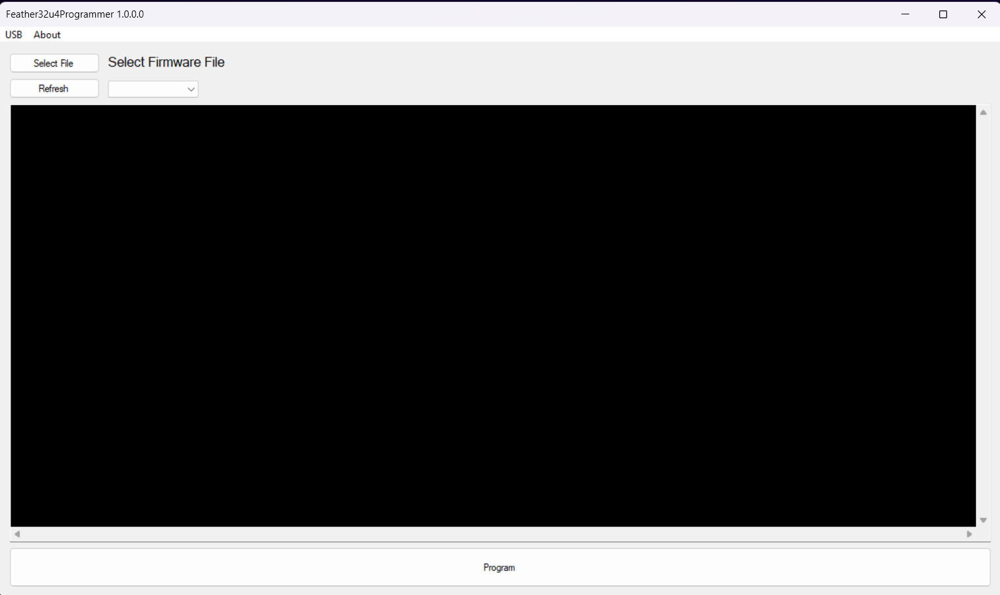
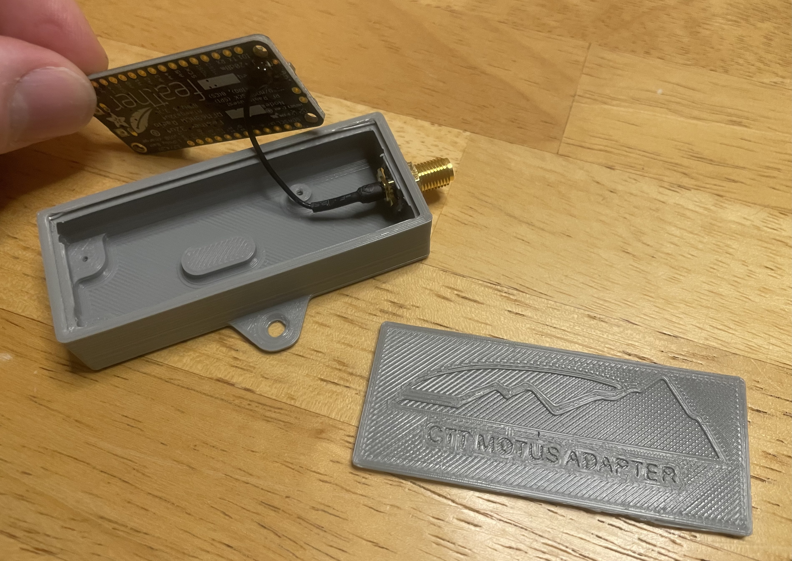
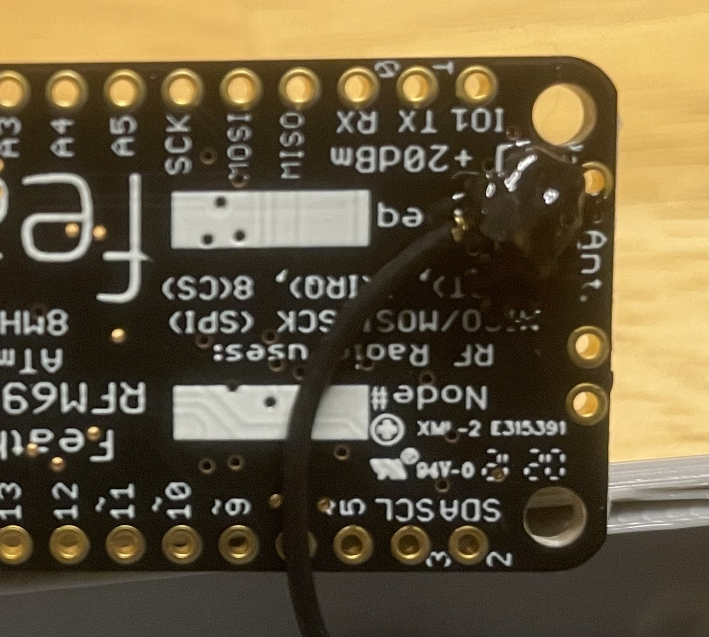
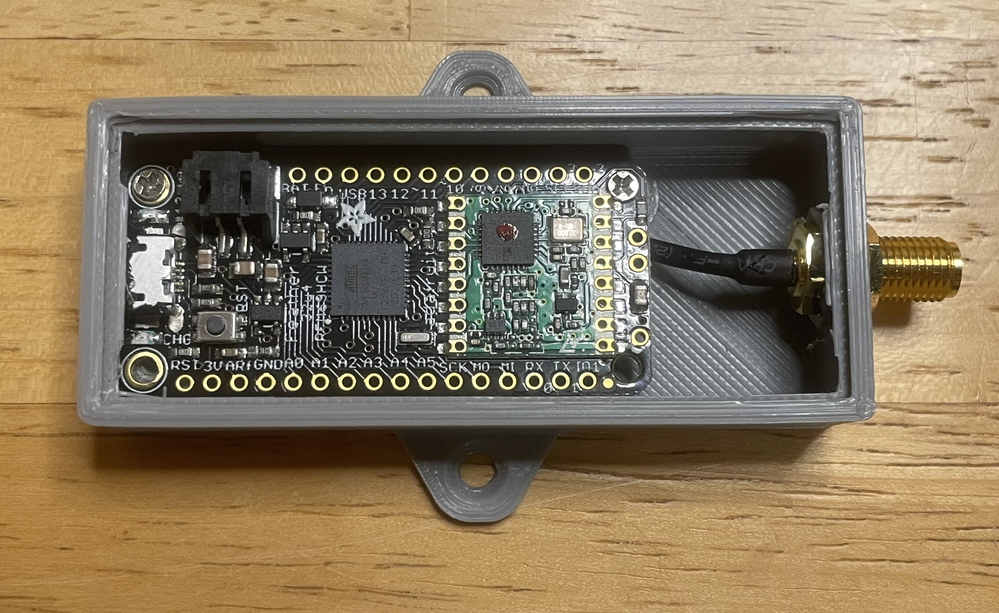
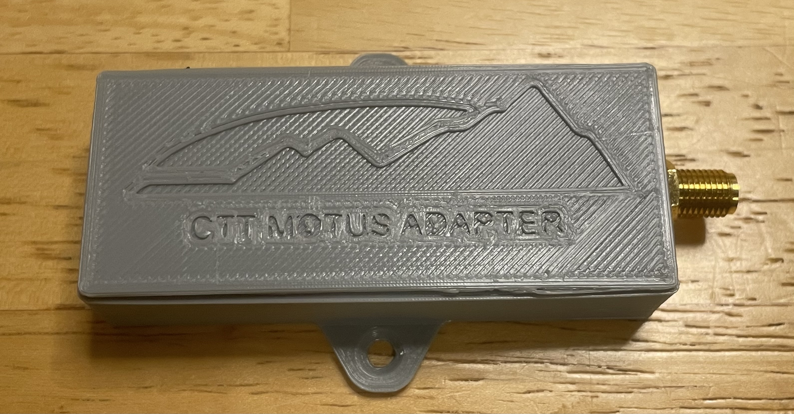

# CTT Motus receiver dongles for 434 MHz (dual-mode) capability on SensorGnome

Once you have the SensorGnome loaded with the necessary software to detect CTT LifeTags/ PowerTags (i.e., it's "dual-mode"), you will require a USB receiver dongle for each antenna listening at 434 MHz. These are often referred to as "CTT Motus dongles." &#x20;


_CTT stopped manufacturing these dongles in early 2023. However, they have generously provided the firmware and 3D printing schematics that make it possible to build and assemble your own. Below we provide the necessary components and general steps, which we will expand on in the near future._


**1)** Acquire the necessary components and files

* [**AdaFruit Feather 32u4 Radio (RFM69HCW)**](https://www.adafruit.com/product/3077)
* [**uFL surface mount antenna connector**](https://www.adafruit.com/product/1661)
* (2-3) [M1-0.25 x 2mm screws](https://www.amazon.com/uxcell-Stainless-Phillips-Furniture-Connection/dp/B0C1SCVNDZ?th=1) (or similar), for securing Feather to case
* [**uFL to SMA bulkhead adapter**](https://www.amazon.com/gp/product/B07P71FX45/ref=ox\_sc\_act\_title\_1?smid=A1TE63QTMAEOQO\&th=1) (a shorter, more flexible cable is preferred)
* [**USB-A to microUSB cable**](https://www.amazon.com/SABRENT-Charging-Android-Premium-Charger/dp/B011KMSNXM?th=1) **or** [**USB-C to microUSB cable**](https://www.adafruit.com/product/3879)**,** depending on your computer's USB port availability. If you can use a USB-A cable with your computer, and get a short one similar to the example linked, you can use it later when installing the CTT Dongle as part of the SensorGnome.
* **Arduino Feather Programmer and CTT Dongle firmware bundle below**



* **CTT Dongle case 3D printing  STL files below**



**2)** Connect the AdaFruit Feather board to a USB port on your computer. The Feather board has a microUSB connection, so you'll need the USB cable.

**2)** Unzip the Arduino Feather Programmer and CTT Dongle firmware bundle to your computer.

**3)** Within the newly unzipped directory, run the `Feather32u4Programmer.exe` program. It should look something like this:

<figure><figcaption>
CTT Dongle programming window
</figcaption></figure>

**4)** Once the program window opens, from the drop-down box, select the COM port that the Feather device is connected to. If you have multiple COM ports listed, you can identify the correct port by (a) noting which COM ports are listed, (b) unplugging the device, (c) pressing the`Refresh` button, (d) see which port has disappeared from the list of COM ports, (e) plugging the device back in, and (f) refreshing again and selecting the new COM port.

**5)** Press the `Select File` button and navigate to the `station_radio_v_3_0_1.hex` file located in the `Firmware` directory of the bundle you unzipped in Step 2.

**6)** Press the `Program` button at the bottom of the window and wait until the program indicates the firmware installation is done. You may then close the program and disconnect the Feather device.

**7)** Solder the uFL surface mount connector to the underside of the Feather ([see here for tips](https://learn.adafruit.com/adafruit-feather-32u4-radio-with-rfm69hcw-module/antenna-options#ufl-antenna-2432562)).&#x20;

**8)** Print the body and lid of the CTT dongle case with your 3D printer.

**9)** Install the SMA bulkhead first, tightening it securely and helping the bulkhead to fit into the hexagonal opening that fits its base.&#x20;

<figure><figcaption>
SMA bulkhead installed and tightened securely.
</figcaption></figure>

**10)** Attach the uFL connector to the newly-installed uFL surface mount connector on the bottom of the Feather. This connection can easily come undone, so secure with some liquid electrical tape or high temperature hot glue.

<figure><figcaption>
uFL connector secured with liquid electrical tape.
</figcaption></figure>

**11)** Insert the Feather into the case, carefully maneuvering the SMA to uFL cable under the board and around the 3D printed board support, aligning the corner mounting holes with the screw mounts in the bottom of the case. Install 2-3 of the M1 screws in the corner, securing the board to the base.

<figure><figcaption>
M1 screws in and secure. Install at least one on each end of the Feather board.
</figcaption></figure>

**12)** Attach the case lid. It may be easiest to insert one long side in first and then press firmly on the opposite side until the lid snaps into place.

<figure><figcaption>
Completed CTT Motus dongle, ready for installation in a SensorGnome.
</figcaption></figure>

**13)** To use with a SensorGnome, you will need a [USB-A to microUSB cable](https://www.amazon.com/6in-Micro-USB-Cable-6-inches/dp/B003YKX6WM), preferably 25cm or less. Connect to a USB port on the SensorGnome via the USB-A to microUSB cable. The antenna connects to the SMA connector, similarly to a FUNcube dongle. This may be the same one you used above during firmware installation.
