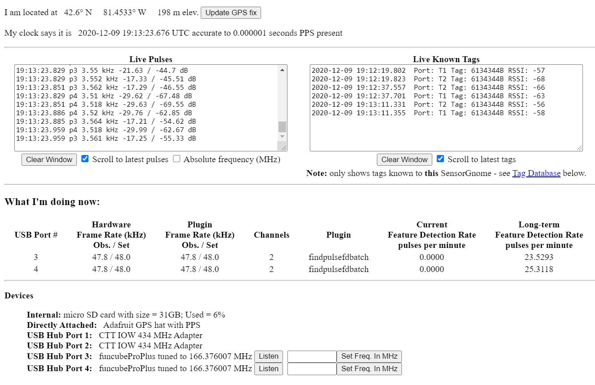

# CTT LifeTag compatibility (dual-mode)

By default a SensorGnome is capable of detecting only Lotek Nanotags. However by applying a software patch a SensorGnome can also detect CTT LifeTags/ PowerTags. We refer to SGs that are listening for both tag types as “dual-mode” SensorGnomes.&#x20;


_You will not be able to use the same dongles for CTT tags as you use for Lotek tags. For CTT-compatible dongles, contact _[_CTT _](https://store.celltracktech.com/products/lifetag-motus-adapter)_or Birds Canada._


**1) **Download the CTT compatibility patch from the link below

* **Raspberry Pi.**  [2021-07-09-rpi\_ctt.tar.bz2](https://s3.amazonaws.com/media.celltracktech.com/sensorgnome/raspberry/2021-07-09-rpi\_ctt.tar.bz2)
* **BeagleBone.** [2018-12-06\_sensorgnome\_beagle\_ctt\_update.tar.bz2](https://s3.amazonaws.com/media.celltracktech.com/sensorgnome/beaglebone/updates/2018-12-06\_sensorgnome\_beagle\_ctt\_update.tar.bz2). Dual-mode function for BB SG's has not been fully implemented. It works, but there are some steps required on the back-end to enable this. If you wish to make a BB SG dual-mode, please [contact Motus](mailto:motus@birdscanada.org) and we will assist you.

**2)** Rename the downloaded file to `sensorgnome_update.tar.bz2`

**3)** Connect to the SG and navigate to the `uboot`folder&#x20;



#### Raspberry Pi_** **uboot _**folder **

* FTP connection (e.g. in FileZilla)
  * `/dev/sdcard/uboot`
* Directly on MicroSD card when removed from powered-down RPi
  * `/uboot`



#### BeagleBone _uboot _folder&#x20;

* FTP connection (e.g. in FileZilla)
  * `/boot/uboot`
* Shared network drive (e.g. in Windows Explorer)
  * `\\192.168.7.2\root\boot\uboot\`




If you keep a copy of the Raspberry Pi SG software on your computer, you can simply copy in the renamed CTT patch into the _uboot _folder on your computer. Now every time you load this software onto a Raspberry Pi, it will be dual mode by default.


**4) **Copy the renamed software patch into this folder

**5) **Power down and reboot the SG.

**6)** Once powered up, connect to the SG and open the Web Interface

If the process was successful you should see any attached CTT dongles in the "Devices" pane of the Web Interface. However, they will **not **be displayed in the "What I'm doing now" pane. Additionally, both of these panes will _only _be displayed if there is a Nanotag-compatible dongle, such as a FUNcube dongle, attached.

It's possible that you will also see CTT tag IDs in the Live Known Tags section. These may be the signals of actual tags in the vicinity, or they be the product of background radio noise that happens to resolve to a tag ID, which is still useful in confirming that the SG is in fact listening for CTT tags. CTT tag hits will never show up in the Live Pulses Pane as this pane only displays radio pulses consistent with Lotek tag signals.


It sometimes requires two complete boot cycles of the SG for this process to succeed, so if you don't see your CTT dongle even though you have both a FUNcube and CTT dongle attached, reboot and try again.

