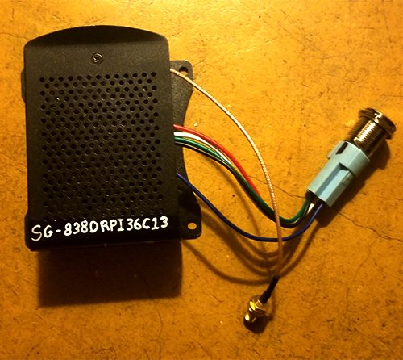
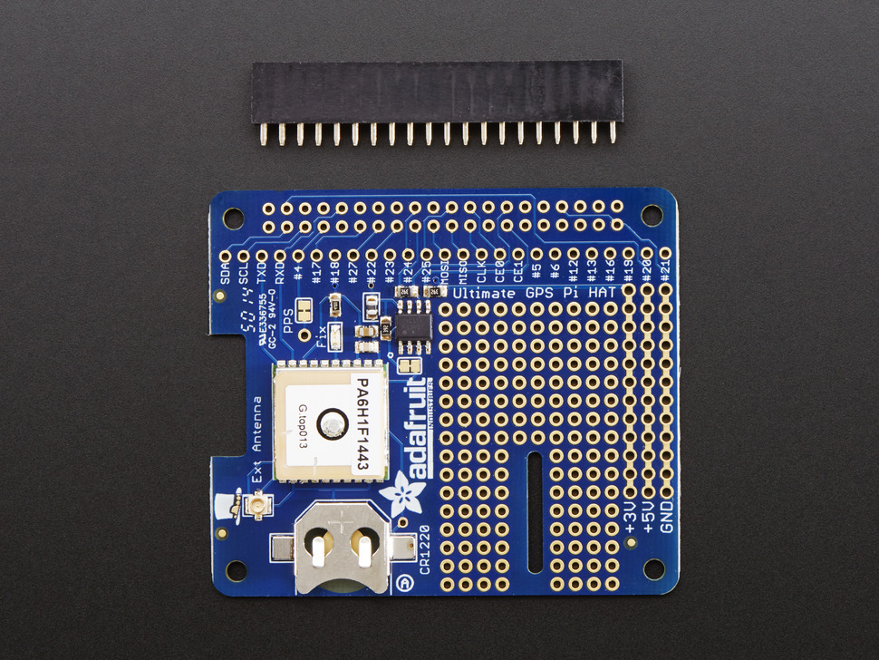
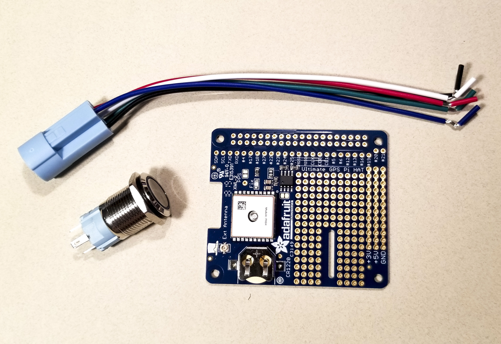
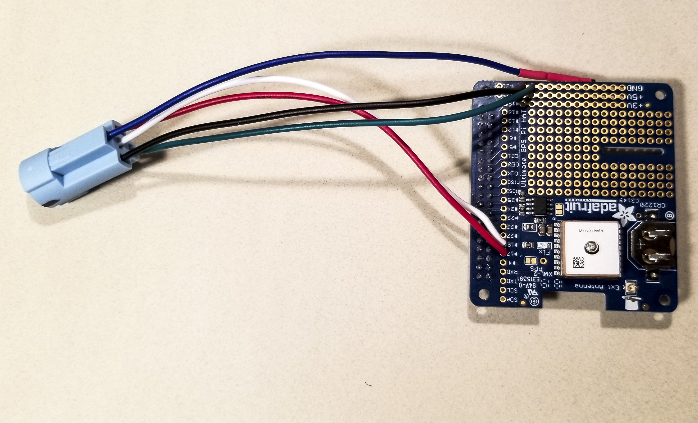
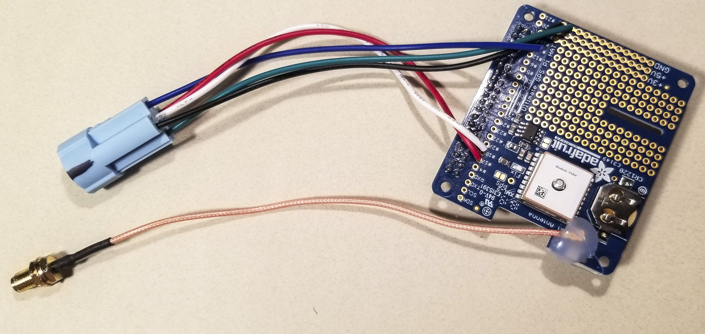

# How to Build a Raspberry Pi Based Sensorgnome

## Introduction

SensorGnomes are an essential component of the [Motus Wildlife Tracking
System](https://motus.org/). These devices act as radio receivers in a
world-wide network, listening to radio transmitters that have been
deployed on birds, bats, and insects by researchers trying to answer
questions about movements on multiple scales.

The SensorGnome was originally designed at the Phil Taylor Lab at Acadia
University and is now available for sale by
[Compudata](https://compudata.ca/sensorgnome/) and [RFS
Scientific](https://www.rfsscientific.com/).

Here I explain how to build one of these devices yourself.

See [Sensorgnome.org](https://sensorgnome.org/) for more information.

### Contents
  - **[Assembling the GPS HAT](#assembling-the-gps-hat)**
  - **[Configuring the Raspberry Pi](#configuring-the-raspberry-pi)**

*A finished Sensorgnome, ready to be deployed.*

## Assembling the GPS HAT

### Supplies

 -   Raspberry Pi Model B v1.2
 -   Raspberry Pi Case
 -   GPS HAT
 -   40-pin header
 -   CR 1220 battery
 -   uFL to SMA Adaptor
 -   GPS Antenna
 -   Micro SD Card and Reader - minimum of 16 GB recommended
 -   Laptop
 -   USB Power Adaptor with Micro USB
 -   Waterproof Momentary Pushbutton Switch with LED
 -   Socket for Pushbutton

### Tools

 -   Soldering iron
 -   Solder
 -   Flux
 -   Solder wick and/or solder sucker to clean up any mistakes
 -   Hot glue gun + hot glue

### Steps

#### Step 1: Solder 40-pin Header to GPS HAT


GPS HAT purchased from Adafruit typically comes with a 40-pin header
that must be soldered to the board.

Instructions on soldering will not be described here.


*GPS HAT, ready to have the header soldered to it.*

#### Step 2: Soldering Pushbutton to GPS HAT

Pushbutton comes with multiple pins – see the specifications for your
button to identify each terminal. Plug the pushbutton socket into the
pushbutton so you know which wire corresponds with each pin.

Pins are soldered to the GPS HAT in the following order:

1.  Netagive and common switch terminals to ground
2.  Positive to GPIO\#17
3.  Normally Open to GPIO\#18

Solder the wires of the Pushbutton Socket through the topside of the
boards so that the wires come out of the topside.

Double-check you are soldering the wires to the board in the correct
order before you start soldering. There may be one wire left unused -
you can leave it loose.

Instructions on how to solder will not be outlined here.

  | Button Symbol | Button Terminal | GPS HAT |
  |-|-|-|
  -      |        Negative        |   Ground
  C1     |        Common Switch   |   Ground
  +      |        Positive        |   GPIO\#17
  NO1    |        Normally Open   |   GPIO\#18

*GPS HAT, ready to have the pushbutton soldered to it.*

*GPS HAT, with the pushbutton soldered to it.*

#### Step 3: Attatching GPS external antenna adaptor

Plug the uFL end of the uFL-to-SMA connector onto the uFL port on the
GPS HAT, located adjacent to the square GPS Module and battery slot.

Use a hot glue gun to help fix the uFL connector to the board.

Insert the CR1220 battery into the battery slot, positive (flat) side
up.

*GPS HAT fully assembled*

#### Step 4: Assembling Raspberry Pi

Plug the GPS HAT on to the Raspberry Pi board using the 40-pin header.

Install the Raspberry Pi + GPS HAT in the Raspberry Pi Case.

*A finished Sensorgnome.*

## Configuring the Raspberry Pi

### Installing Software

1.  Insert the *MicroSD card* in to the *MicroSD card adaptor*.
2.  Plug the *MicroSD card adaptor* into your laptop.
3.  Format the *MicroSD* card as **VFAT** or **FAT32** file system.
4.  [Download the latest software from
    SensorGnome.org.](https://public.sensorgnome.org/Raspberry_Pi_Sensorgnome/)
5.  Unzip the contents of the software package onto the *MicroSD card*.
6.  Safely remove the *MicroSD card* from your laptop.
7.  Insert the *MicroSD card* into the SD card slot of your *Raspberry
    Pi*.
8.  Plug in your *USB Power Adaptor* into an AC wall outlet and then
    into the *Raspberry Pi* to power on your device.
9.  You should see the LED on the *Raspberry Pi*.
10. Allow 1-2 minutes for the *Raspberry Pi* to boot up.
11. Once it has booted the *Pushbutton* should begin blinking if you
    press it once. Press it once again to make it stop blinking.

###  Set Wi-Fi Network Properties

You can use the SensorGnome's on-board Wi-Fi to make the device connect
to our web servers and automatically download data so you don't have to
do it manually. In addition, you can use the interface available on
sensorgnome.org to view the SensorGnome's live web interface and
diagnose any issues it may have. At this time, this feature is only
compatible with Wi-Fi networks that are WPA2 password protected;
networks without a password will not work! Alternatively, you can use a
hard-wired connection by plugging an Ethernet cable into your
SensorGnome and router. To use Wi-Fi, follow these steps:

1.  From the root folder, navigate to the following folder:
    `boot/uboot`.
2.  In here you can find a file called 'network.txt'. Right click on it
    and select 'view/edit'.
3.  This file contains all the instructions required to set the Wi-Fi.
    Once completed, save and close the file.
4.  To make the changes come into effect, you will need to reboot your
    SensorGnome.
5.  Once rebooted, review that your SensorGnome has been connected
    successfully by searching for its serial number in the list of
    receivers found on <http://sensorgnome.org/status>.

### Add or Change On-board Tag Database

It is not required to add a tag database to your SensorGnome in order to
get detections of your tags. But note, tags must always be registered on
Motus.org prior to deployment, otherwise you will never get detections!
Tag databases are only required if you wish to identify the specific
tags while viewing your SensorGnome's live web interface. This can be
useful when testing tags or your SensorGnome in the field, or when using
the SensorGnome to aid in tag activation, rather than using a Lotek
receiver. To install a tag database on your SensorGnome, follow these
steps:

1.  Go to Motus.org and navigate to 'Manage Tags' on the project of
    choice.
2.  Click the 'Download Tag Database' button on the top-right corner of
    the page.
3.  Select the and download database you wish to add (they are labelled
    by registration date).
4.  Rename the file to 'SG\_tag\_database' – keep the '.sqlite' file
    extension.
5.  While connected to the SensorGnome with FileZilla, navigate to the
    'root' folder and then go to 'boot' / 'uboot'.
6.  Copy the tag database to this folder – if a file already exists,
    rename it to something else or delete it.
7.  Restart your SensorGnome to load the new tag database.
8.  Use either steps 6 or 7 to connect to your SensorGnome and view the
    web interface.
9.  If your database was installed correctly, you should see the tags
    listed in the text box located on the bottom of the page. If not,
    you may need to try again.
