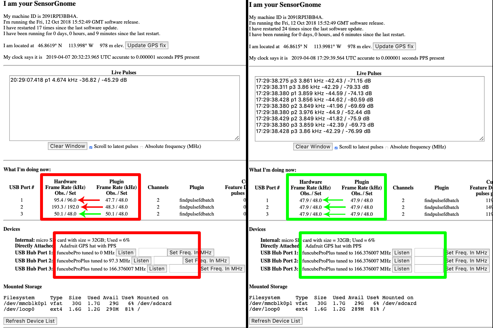

# How to update the FUNcube Dongle Firmware

## Introduction

FUNcube Dongles are a component used in
[SensorGnomes](https://sensorgnome.org/) and [CTT
SensorStations](https://celltracktech.com/) for listening to tags
developed by [Lotek Wireless](https://lotek.com/). They were originally
developed as a teaching tool for satellite communications and have been
repurposed for many custom radio projects.

The firmware loaded onto the FUNcube Dongles by default is incompatible
with the Sensorgnome software. Differences in hardware and plugin frame
rates result in odd behaviour that often goes oncaught. Sometimes it
will take a minute or two before this can be seen on the SensorGnome Web
Interface. The image below shows FUNcubes with the wrong firmware tuned
to the incorrect frequency.

Here I will explain how to correct this problem by reimaging the FUNcube
dongle.

This guide is a simplified form of [the guide provided on the FUNcubed
dongle
website](http://www.funcubedongle.com/MyImages/FCDFirmwareUpdateGuide.pdf).

*FUNcube Dongles tuned to the wrong frequency (left) compared to after they were fixed (right).*

---

## Supplies

 -   FUNcube Dongle Pro Plus.
 -   Laptop or desktop computer.

## Downloads
 - **[Frequency control program](http://www.funcubedongle.com/MyImages/FCHIDBL2.001.zip)**
 - **[Bootloader](http://www.funcubedongle.com/MyImages/FCHIDBL2.001.zip)**
 - **[Firmware](http://www.funcubedongle.com/MyImages/FCD2.20.03.48.pro.bin)**

1.  Download and unzip the above software.

2.  Plug the FUNcube dongle in and run the **frequency control program**.

3.  You should see something like this:

  

4.  Click on **‘Switch to bootloader’**. You should get an error in the
    box, but ignore it and just close the program.

    

5.  Open the bootloader program you downloaded and unzipped previously. You should see the following text
    acknowledging the FUNcube dongle has been recognized:

    

6.  Click ‘**Open file**’ and select the FUNcube dongle firmware you
    downloaded previously.

7.  Click ‘**Write firmware’.** The program may freeze for a moment as
    firmware is being written.

8. Once complete, you should see the following message:  
    

9. Click ‘**Exit**’ and unplug the FUNcube dongle from your computer.
