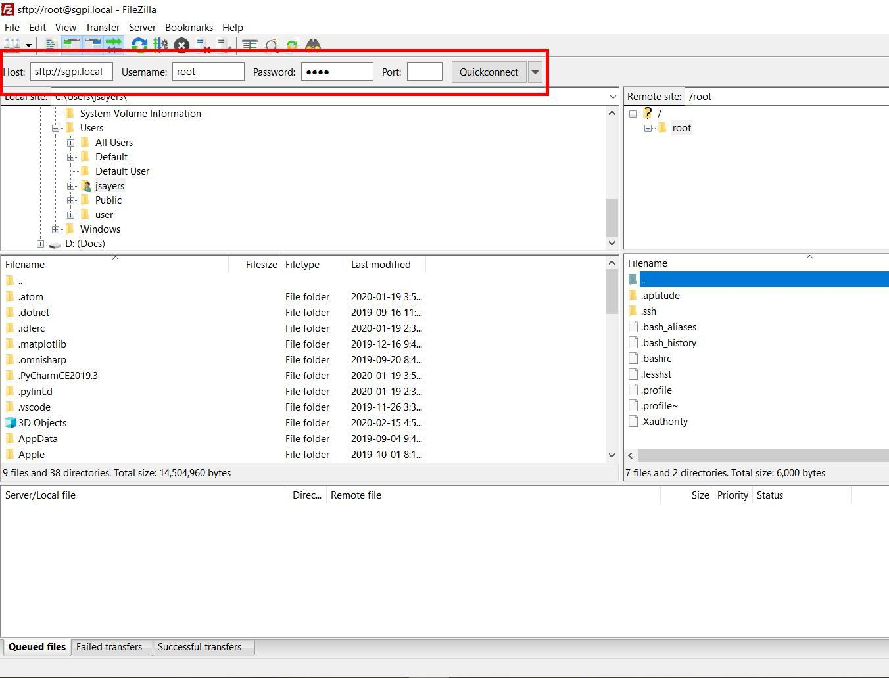

--- 
title: "SensorGnome User Guide"
author: "The Motus People"
date: "`r Sys.Date()`"
output:
  html_document:
    df_print: paged
  pdf_document: default
description: A guide to using a SensorGnome, part of Motus Wildlife Tracking System
documentclass: book
link-citations: yes
bibliography:
- book.bib
- packages.bib
site: bookdown::bookdown_site
biblio-style: apalike
---


# Introduction and Overview

TEST This document explains how to connect to your SensorGnome, check its status via the Web Interface, download detection data from your SensorGnome, and update the software.

Note that the instructions differ somewhat depending on whether you have a SensorGnome powered by a Raspberry Pi computer, or one powered by a BeagleBone computer.

A cheatsheet of connection types is provided below, with more detailed informaiton on each aspect provided in the text.


1. Raspberry Pi SensorGnome Cheatsheet
	- Access Web Interface
        -  Connection type: Ethernet cable
            - Navigate to http://sgpi.local on Firefox or Chrome 
        -  Connection type: WiFi Hotspot (WiFi password is the same as the network / SensorGnome ID)
            - Navigate to http://192.168.7.2 on Firefox, Chrome, or smartphone browser
	- Download detection files
        - FTP Transfer (using FileZilla)
          - Connection type: Ethernet
            - host: sftp://sgpi.local
            - username: root
            - password: root
            - SGdata path: /dev/sdcard/Sgdata
          - Connection type: WiFi Hotspot (WiFi password is the same as the network / gnome ID)
            - host: sftp://192.168.7.2
            - username: root
            - password: root
            - SGdata path: /dev/sdcard/Sgdata

2. BeagleBone SensorGnome Cheatsheet
    - Complete [first steps](#firststeps) the first time you try to connect to a BeagleBone
    - To check live status via Web Interface
        - Connection type: USB
			      - navigate to http://192.168.7.2 using Firefox or Chrome
    - To transfer detection files
		- Connection type: USB
			- Option 1: FTP Transfer (using FileZilla)
				- host: sftp://192.168.7.2
				- username: root
				- password: root
				- SGData path: /media/internal_SD_card/Sgdata
			- Option 2: Shared Network Drive (using Windows File Explorer)
				- SGData path : \\192.168.7.2\data\internal_SD_card\SGdata 
	- To update software or deplyoyment.txt
		- Connection type: USB
			- Navigate to \\192.168.7.2\root\boot\uboot\ using Windows File Explorer
				- Copy 

# Connecting to your SensorGnome {#connect}

Connecting to your SensorGnome is the only way to confirm whether it’s working properly when you leave it, so it is a very crucial step on any station visit. When you are testing an SG for the first time, this should be your first step.

The steps to connect differ depending on whether you are using a Raspberry Pi or BeagleBone based SensorGnome.


## Raspberry Pi SensorGnome

There are two methods of connecting to a Raspberry Pi based SG (RPi SG).


### Option 1: WiFi Hotspot

The RPi that powers the SG is capable of producing a local WiFi hotspot that a computer or smartphone can connect to. This doesn’t connect to the internet, but simply forms a network connection between the SG and your device.  

An RPi SG with the ability to create a hotspot will have a silver button somewhere on the outside of the SensorGnome case. This button is used to activate the hotspot. If there is no button anywhere on your RPi SG then it will not be capable of creating a hotspot and you will have to connect with [Option 2: Ethernet Cable](#ethernet).

```{r echo=F, fig.align = 'center ',fig.cap='The button on the left is used to activate the Wifi hotspot'}
knitr::include_graphics("images/wifibutton.png")
```

The WiFi hotspot is convenient because, once a computer (or smartphone) has connected once to that particular RPi SG, it will not require any additional configuration and all further interactions with that SG can be performed by pressing the WiFi button and leaving the SG itself closed.  

The disadvantage is that activating the WiFi hotspot via the button can be finicky. Sometimes it takes several tries, and sometimes it doesn’t work at all.  

1.	Activate the WiFi hotspot by double pressing the WiFi button on the SG case. If properly activated the button will commence a slow on/off blinking pattern (the actual pattern of the blinking may vary).

2.	The WiFi hotspot should soon appear in the list of available WiFi networks to connect to. The name of the WiFi Network will be the same as the serial number of the RPi SG (e.g. SG-A123RPI43D3).  
    - It can take up to a minute for the WiFi network to appear
    - The LED light in the button is usually bright enough to view in sunlight, but occasionally it is very faint and difficult to see
    - The timing of the double press can be finicky and difficult to activate. If it doesn’t work, try it again.
3.	Connect to the new WiFi network. The password is the same as the network name, which is the same as the serial number of the RPi SG. This is just a local network so there won’t be any internet once connected.  

4.	Open a web browser (Firefox or Chrome)  

5.	Navigate to http://sgpi.local (or http://192.168.7.2)  

6.	You should now see the [SensorGnome Web Interface](#webinterface)


### Option 2: Ethernet Cable {#ethernet}

Connecting via Ethernet cable is usually a straightforward method that requires no configuration.  

1.	Connect the RPi to your computer with the Ethernet Cable. Many newer computers do not have an Ethernet jack and require an Ethernet -> USB adapter

2.	Open a web browser (Firefox or Chrome)  

3.	Navigate to http://sgpi.local in the address bar  

    a)	Note: It will take several seconds for the connection to establish. Sometimes up to a minute or so.  
    
4.	You should now see the [SensorGnome Web Interface](#webinterface)

*Note: you may require iTunes to be installed on your computer since it contains software (called Bonjour) that facilitates communication between the computer and the network.*


## BeagleBone SensorGnome


### First steps {#firststeps}

Prior to connecting to a BeagleBone SensorGnome for the first time, you may need to complete the following steps. 

1. **Install BeagleBones drivers**. Direct link to x64 Windows Driver [here](https://beagleboard.org/static/Drivers/Windows/BONE_D64.exe). More information here and other versions here, about halfway down the page: http://beagleboard.org/getting-started  

    + Note: After June 2016, drivers are apparently no longer needed ([here](https://archived.sensorgnome.org/Connecting_to_your_SensorGnome/Installing_drivers_for_the_SensorGnome_on_your_computer/). However older versions of the software may still be encountered.  
    
    + Note: Sometimes Windows prevents these drivers from being installed since they are unsigned. There may not be any error message regarding the reason for the installation failure (see below). Instructions on how to temporarily disable these security checks so that the drivers can be installed can be found [here](https://www.howtogeek.com/167723/how-to-disable-driver-signature-verification-on-64-bit-windows-8.1-so-that-you-can-install-unsigned-drivers/) (option 2 is simplest). Restart your computer after you have successfully installed the drivers in order to reset the security bypass.  
    
```{r echo=F, fig.cap='Unsigned drivers may fail to install without an explicit error messsage', fig.align='center'}
knitr::include_graphics('images/driverfail.png')
```
    
2. **Allow SMBv1 connections on Windows**. 
Later versions of Windows block connections using this protocol since it's not as secure as newwer protocols. This can be overridden by going to Control Panel > Programs > Turn Windows Features On or Off >  and Expand SMB 1.0/CIFS File Sharing Support. Toggle "SMB 1.0/CIFS Client" On. More info can be found  [here](https://www.windowscentral.com/how-access-files-network-devices-using-smbv1-windows-10). Note that since you are disabling a safety feature, it is best not to suppress the warning message you will get when you connect in FileZilla, though this means you will be have to click "OK" on the warning screen each time you connect.

Note: This is only necessary when accessing the BB via [shared network drive](#shareddrive) (one of 3 options to transfer data to and from a BB SG).

```{r echo=F, fig.cap='SMCv1 connections must be enablesd', fig.align='center'}
knitr::include_graphics('images/smb.png')
```

### Connecting via USB cable

A USB cable is currently the only method of connecting to a BB SG. 

```{r echo=F, fig.cap='A Mini-USB connection is used to connect a BB SG to a computer', fig.align='center'}
knitr::include_graphics('images/bbusb.png')
```

Connect the end with the Mini USB connection to the BeagleBone, and the end with the standard USB port to your computer. 

Allow several seconds, or up to a minute, for the connection to establish. Open a modern browser (e.g. Firefox) and visit http://192.168.7.2. You should now see the Web Interface.

Note: If the BB is already powered on by using the power cable, you can simply plug in the USB cable. The USB connection will also power the BB by itself if needed.

# The Web Interface

The Web Interface is where you can check the status of your SensorGnome, to ensure that all the components are running as they should. As such, it's a crucial part of any site visit, and generally be **the first and last thing you do** whenever you work with your SensorGnome

**The contents of the Web Interface is the same regardless of whether you have a BeagleBone or Raspberry Pi SensorGnome**

In order to access the Web Interface, you must first connect to your SensorGnome following the instructions above. Recall that the URL differs depending on how you are connected (visit http://sgpi.local if you are connected to a Raspberry Pi SG via Ethernet cable, otherwise visit http://192.168.7.2).  

Once you have connected to the RPi SG you should be able to load the Web Interface. On a computer, use Firefox or Chrome (avoid Internet Explorer). Recall that the address is different depending on whether you are connecting via Ethernet or WiFi Hotspot.  
- If connecting via WiFi Hotspot, navigate to http://sgpi.local or http://192.168.7.2
- If connecting via Ethernet, navigate to: http://sgpi.local 
The Web Interface itself should look the same regardless of how you access it. On it you’ll find very important information related to how your SensorGnome is functioning: what software version it is running, what dongles are attached, if the antennas are picking up any radio activity, etc. It’s a great idea to take a photo of the Web Interface once you have it opened. This will have the date and time you visited it, the location (if taken on a smartphone with accurate location), and can be a very helpful reminder down the road of what the status was that day.
•	The serial number of the RPi powering your SensorGnome, referred to as “Machine ID”. Note that Raspberry Pi serial number will always have “RPI” in the middle of it, whereas a BeagleBone serial number will have “BBB” in the middle of it.
•	The Software version the SensorGnome is running. This only refers to the primary software; any patches that have been applied will not reflected up here.
•	The GPS Location and Time (in UTC, not likely your local time zone). Double check these to make sure they look right. If the GPS is not working properly your data may end up with incorrect dates. This will prevent tag detections from being identified in your data.
•	Live Pulses represent any radio activity picked up by the antennas. This may be an actual tag, but more likely it’s just background noise. If live pulses are present, they can be helpful in confirming that all antennas and dongles are properly functioning. In the example below, only the antenna plugged in to USB port 4 (P4) is registering activity at the moment. Often, in areas with less background radio noise, there won’t be any Live Pulses.
•	What I’m Doing Now displays the status and settings of your attached dongles. If you do not see this section, it means that your SensorGnome is not recording!
o	The first section displays the settings of your attached dongles. This generally isn’t of great interest to the average user except to note that all your dongles show up. This will also display the average rate of pulses per dongle over the last time period. 
o	“Devices” is an important section. This lists every unit attached to the RPi. You should see all your dongles listed here, along with the USB port they are attached to. You should see your GPS attached. This will also give you the status of the device storage, and how much is filled up. 


# Transferring Data and Files

## Option 1: FTP Connection

An FTP Connection is the preferred method of transferring files to and from a SensorGnome in most cases. In these examples, we use the free and open-source [FileZilla](https://filezilla-project.org/) program, though the process would be similar for other FTP clients. The instructions are the same for both Raspberry Pi and BeagleBone SG's, though the credentials needed to connect are different.

1) Connect to the SensorGnome using the process described [above](#connect)

2) Open FileZille and enter the remote host address and login credentials in the top left bar. The host address differs depending on whether you are a RPi or BB SG. In each case you will log in as user: root and password: root.


```{r echo=F, fig.cap='Enter the host address and credentials in the top left. These are the credentials for a Raspberry Pi SensorGnome.', fig.align='center'}

```

Once connected, the two left hand panels will represent the folder structure on your own local computer, and the right hand panel will represent the folder strucure on the SensorGnome. If you are downloaded detection files, you will need to navivate to the SGdata folder. If you are modifying the deployment.txt file, applying a software patch, or configuring internet access over WiFi, you will need to navigate to the uboot folder.


*Tip: You can save the connection configuration as well as create bookmarks for specific paths in FileZilla. This will save a lot of time when in the field.*


**Raspberry Pi SG**  

  + host address: sftp://sgpi.local* 
  + username: root
  + password: root
  + SGdata path: 
  + uboot path: 
  
  * *when connnecting via WiFi Hotpsot, you may also use the host address: sftp://192.168.7.2* 
    
**BeagleBone SG**

  + host address: sftp://192.168.7.2
  + username: root
  + password: root
  + SGdata path: 
  + uboot path: 
  

## Option 2: Removing the MicroSD Card


## Option 3: Shared network drive {#shareddrive}


This only works with a BeagleBone based SensorGnome. It is not the recommended method of transferring files but can be occasionally be useful as an alternate method.


# Downloading detection data

# Updating software

## Raspberry Pi SensorGnome

## BeagleBone SensorGnome

### Create an image disk with the latest software

In order to update the software running on a BeagleBone SensorGnome you must first create an image disk containing the latest software version. 

1. Download the latest SensorGnome software. There are two versions of this: the full software image and the rescue image. They do different things, but it useful to have both. The most recent version of both is 2017-03-06.

    i) The [**full software**](https://public.sensorgnome.org/Beaglebone_Sensorgnome_Images/sensorgnome_image_2017-03-06_15-33-00.img.7z) is the primary software that runs on the BeagleBone and powers the SensorGnome. When you insert a MicroSD card with the full software image on it, it will be written to the internal memory of the BeagleBone. This is the way to update the software if you are running an earlier version than 2017-03-06, and is one of the first steps in trying to restore a BeagleBone SensorGnome that is having issues.  
  
    ii) The [**resuce image**](https://public.sensorgnome.org/Beaglebone_Sensorgnome_Images/sensorgnome_rescue_image_2017-03-06_15-33-00.img.7z) is nearly identical to the full software image, except that it does not attempt to write the software to the internal memory of the BeagleBone. Instead, the software runs directly from the MicroSD card itself. This is most helpful for BeagleBones that won't boot properly as it can allow access to locally stored files, but it can also be helpful in "resetting" otherwise malfunctioning BeagleBones (after attempting to reimage with the full software version).  
    *Note: If you wish to view other software versions you can view them [here](https://public.sensorgnome.org/Beaglebone_Sensorgnome_Images/).*
  
1. Unzip the downloaded file using [7-Zip](https://www.7-zip.org/). After uncompressing you will have an "image" file with the extension ".img".

2. Insert a MicroSD card into your computer, either in the appropriate slot (if your computer has one) or more likely using a USB adapter.

3. Download and install [BalenaEtcher](https://www.balena.io/etcher/), which is free and open-sourced to write---or "flash"---the softare image onto your MicroSD card.

4. Load the softare image file into BalenaEtcher interface and click "Flash". **Note: this will erase anything on the MicroSD card.**

5. When the process is complete, [eject the MicroSD](https://support.microsoft.com/en-us/help/4051300/windows-10-safely-remove-hardware) and remove it from your computer. **Note: Your computer may alert you that the card is corrupt and needs to be formatted. That is expected.**

It's a good idea always to have on hand a MicroSD with the most recent softare and/or to have all the relevant softare on your computer during field visits. Both the full software and the rescue image are useful during site checks.

### Updating or Reimaging the software

Once you have a MicroSD with the latest software image, you can use it update the software on an SG, or to "reimage" the existing software even if it's the same version already. Reimaging can help restore functionality to a BB SG that you cannot connect to, or that otherwise has not been working properly.

1. Fully power down the SG, then remove any existing MicroSD card (if applicable)

2. Insert the image card into the BeagleBone SG and power on

3. Watch carefully for the next several seconds as the pattern of LED flashing will help indicate if the process is working properly. 

    i) Shortly after powering on the BB, the blue LED lights should start randomly flashing for a few seconds
    
    ii) After a few seconds, all four LED lights will flash ON/OFF in unison for another few seconds. This indicates the update/reiminaging process in beginning.
    
    iii) Following this, the LED lights should begin flashing in a "crawling" or "wave" pattern, one after the other in a line. This should continue for several minutes at least. If it only lasts a minute or so, there is a good chance the process failed.
    
    iv) When the process is complete, all four LED lights will remain ON. 
    
    You can watch a video of this process here (Video coming soon)
    
4. You can now power down the BB, remove the image card, power back up, then try to connect and view the Web Interface to confirm everything worked. 

## Applying a software patch

Occasionally a software patch is required to address a bug or make small changes to the underlying software installed on the BeagleBone. 

Download the appropriate software file. 

If navigating to the uboot folder via the Windows shared drive, ensure that you navigate to \\\\192.168.7.2\\root\\boot\\uboot and **not** \\\\192.168.7.2\\boot\\uboot. 

Note: if you wish to update the entire software version, do not use this method. Rather, create an image disk containing the full software version and update that way. Instructions are given above.


# Modifying configuration files

## Deployment.txt

## Configuring internet access

## Downloading tag database to a SensorGnome

Generally speaking, processing of raw detection data to identify tag ID's only happens *after* you upload your data to the Motus server. It is only at that stage that the raw pulse patterns can be compared with *all* tags in the database, including information about which tags are actually deployed at the time the pulses were recorded. 

However it is possible for a SensorGnome to process raw radio data locally and idendify tag codes from that data (rather than just displaying Live Pulses, which cannot be visually resolved to tag IDs). An example would be if a project was deploying tags in the proximity of one of their receivers and they wanted to see those tag ID's live on their SensorGnome to confirm that they were active. 

- Download the tag database from the Motus website
(you may have to merge multiple tag databases together)

- Connect to your SensorGnome

- Establish an FTP connection for transferring files to the SG (or, failing that, use an alternative method of transferring files to the SG)


