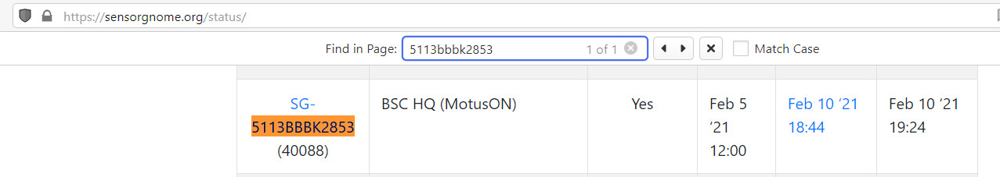

# Data syncing over the Internet

Configuring your SensorGnome to sync detection data automatically results in more up-to-date data, fewer trips to visit a station, and more timely identification (and resolution) of any issues with the receiver. Wherever possible, SG's should be connected to the Internet.

## Option 1: Wired internet over Ethernet

The simplest method of syncing data over the internet is to plug the BB or RPi into the Internet via an Ethernet cable. If the internet is not password-protected, and the software on the SG is up-to-date, the SensorGnome should connect to the Motus server within minutes and begin syncing data an hour later.&#x20;

**1)** Connect an Ethernet cable that is non-password-protected to the SG.

**2)** [Confirm that the SG has checked in with the Motus server on sensorgnome.org/status, then check in again several hours later to confirm that data syncing is occurring.](http://docs.motus.org/sensorgnome/internet#status)

## Option 2: Wi-Fi&#x20;

Connecting over a Wi-Fi network is also an option. In this case a bit of configuration is needed. The Raspberry Pi comes with a Wi-Fi adapter already on-board. Wi-Fi connectivity is also possible with a BeagleBone, though it requires a USB Wi-Fi adapter. The BeagleBone software is configured to work with the [TP-Link TL-WN725N Wi-Fi adapter](https://www.tp-link.com/us/home-networking/usb-adapter/tl-wn725n/). This is an affordable and reliable Wi-Fi adapter that is available from multiple retailers.

**1)** Connect to the SG and navigate to the `uboot`folder



#### Raspberry Pi _**** uboot_ **folder**&#x20;

* FTP connection (e.g. in FileZilla)
  * `/dev/sdcard/uboot`
* Directly on MicroSD card when removed from powered-down RPi
  * `/uboot`


If an RPi SG is connected to the internet, make sure you _don't_ use a MicroSD card that came from another SensorGnome. This may result in data not syncing properly. Always use a new software card that does not contain any existing data files from another receiver.




#### BeagleBone _uboot_ folder&#x20;

* FTP connection (e.g. in FileZilla)
  * `/boot/uboot`
* Shared network drive (e.g. in Windows Explorer)
  * `\\192.168.7.2\root\boot\uboot\`



**2)** Open the `network.txt` file and follow the instructions in the file for adding the network name and password.


The Wi-Fi network you wish to use must be configured with WPA2 security. This is the standard on most Wi-Fi networks already. An SG will _not_ connect to a Wi-Fi network that has no password.


**3)** Ensure that the changes have been saved to the SG, then power down and reboot

**4)** [Confirm that the SG has checked in with the Motus server on sensorgnome.org/status, then check in again several hours later to confirm that data syncing is occurring.](http://docs.motus.org/sensorgnome/internet#status)

_Note: Activating the WiFi hotspot will temporarily disable the connection to the Internet. One the WiFi hotspot turns off, the connection to the Internet will be re-established._

## Checking sync status on sensorgnome.org/status 

You can check the sync status of your networked SensorGnome by visiting [sensorgnome.org/status](http://www.sensorgnome.org/status). This page displays a master list of SensorGnomes that are, or have recently been, connected to the Internet.

The list is is long as it includes receivers from all projects, and deployment names don't always appear (especially if the deployment is a test deployment) so the simplest way of finding your SensorGnome is to hit `CTRL F` in the browser and then type in the receiver **serial number**.&#x20;

The middle column shows the time of the most recent data sync (in UTC/GMT time). For a properly functioning station, this should be within the last few hours.&#x20;

The first column -- most recent connect/disconnect time -- is most useful immediately after powering up or connecting an SG for the first time. Within a minute or so of connecting to the Internet, an SG will show up on this list and you should see the recent time displayed. The first sync won't be attempted for another hour or two (the time displayed in the last column), so check back in later to confirm that data is actually being synced.&#x20;

This is the first place to check to see if a recently connected SG seems to be properly connected to the Internet. However the true test for whether your station is syncing properly is to check if recent data has made it to the Motus database. The quickest way of doing this is on the [receiver map](https://motus.org/data/receiversMap?lang=en), which by default shows all the currently active Motus stations in the network.

