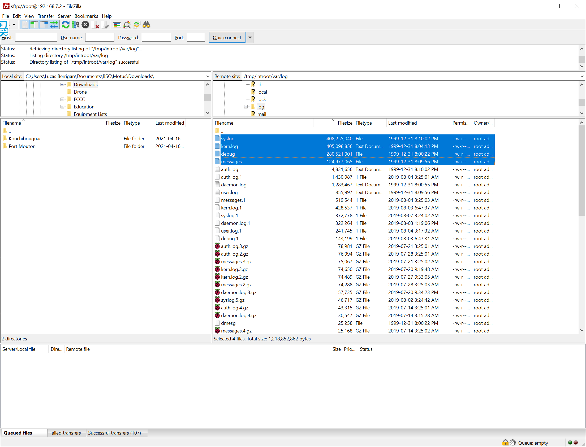

# Recovering a locked BeagleBone Black


You can quickly tell if a BeagleBone Black isn’t taking the image if the ‘crawl’ LED sequence is very short \(~10 seconds\).



Often times you will find corrupted data in the internal storage. This can appear as regular data, except there are an excessive number of files and they are all empty. It is not worth downloading these files – just delete the folder entirely.


The BeagleBone Black keeps its operating system in its internal storage which is more robust than an external SD card; however, sometimes it can get filled up with error logs and detection data if the SD card malfunctions. This causes critical processes to no longer function, resulting in no data collection. In this state, the BeagleBone cannot be fixed by re-imaging it. Instead, files must first be deleted off its internal storage. If all else fails, you can still operate your SensorGnome with just the 'rescue' image on an SD card. Follow the steps below to recover your BeagleBone**.**  

1. If you are able to connect via FileZilla
2. If you can't connect via FileZilla
3. If all else fails

## **If you are able to connect via FileZilla**

1. In FileZilla, navigate to the folder: **./var/log**
2. In this folder, look for very large files \(&gt;100 MB\) and delete them.
3. Navigate to the folder: **./media/system\_internal\_memory/SGdata**
4. This folder may contain VALID data that hasn’t previously been downloaded – if the files appear normal \(and are not empty\), download them to your laptop and upload them to Motus as you normally would. Once data has been downloaded, delete the contents of this folder.
5. In FileZilla, navigate to the folder \(if it exists\): **./boot/uboot/SGdata**
6. Again, this folder may contain VALID data that hasn’t previously been downloaded – if the files appear normal \(and are not empty\), download them to your laptop and upload them to Motus as you normally would. Once data has been downloaded, delete the contents of this folder.
7. Disconnect from the FTP server, unplug the SensorGnome, and power it off.
8. Insert a regular BeagleBone imaging card and power on the SensorGnome.
9. You should now see the regular pattern of LEDs, with the heartbeat lasting several minutes as the software is installed.
10. Once the heartbeat stops and all LEDs are solid, power off the SensorGnome and remove the SD card.
11. Power on the SensorGnome and plug it into a computer once it boots up.
12. You should now be able to connect to the SensorGnome via FileZilla and view its web interface.
13. In FileZilla, navigate to the folder \(if it exists\): **./boot/uboot/SGdata**
14. Again, this folder may contain VALID data that hasn’t previously been downloaded – if the files appear normal \(and are not empty\), download them to your laptop and upload them to Motus as you normally would.
15. Once data has been downloaded, delete the contents of this folder.

## **If you are unable to connect via FileZilla**

1. Download the BBBK rescue image from here: [https://public.sensorgnome.org/Beaglebone\_Sensorgnome\_Images/sensorgnome\_rescue\_image\_2017-03-06\_15-33-00.img.7z](https://public.sensorgnome.org/Beaglebone_Sensorgnome_Images/sensorgnome_rescue_image_2017-03-06_15-33-00.img.7z)
2. Image a microSD card with this image \(must be at least 4 GB\)
3. With the BBBK powered off, insert the microSD card and then power it on.
4. After booting, connect the BBBK using FileZilla.
5. Navigate to the folder: **./tmp/introot/var/log**
6. In this folder, look for very large files \(&gt;100 MB\) and delete them.
7. Navigate to the folder: **./tmp/introot/media/system\_internal\_memory/SGdata**
8. This folder may contain VALID data that hasn’t previously been downloaded – if the files appear normal \(and are not empty\), download them to your laptop and upload them to Motus as you normally would.
9. Once data has been downloaded, delete the contents of this folder.
10. Disconnect from the FTP server, unplug the SensorGnome, and power it off.
11. Remove the rescue image SD card and insert a regular BeagleBone imaging card.
12. Power on the SensorGnome. You should now see the regular pattern of LEDs, with the heartbeat lasting several minutes as the software is installed.
13. Once the heartbeat stops and all LEDs are solid, power off the SensorGnome and remove the SD card.
14. Power on the SensorGnome and plug it into a computer once it boots up.
15. You should now be able to connect to the SensorGnome via FileZilla and view its web interface.
16. In FileZilla, navigate to the folder \(if it exists\): **./boot/uboot/SGdata**
17. Again, this folder may contain VALID data that hasn’t previously been downloaded – if the files appear normal \(and are not empty\), download them to your laptop and upload them to Motus as you normally would.
18. Once data has been downloaded, delete the contents of this folder.

## If all else fails

Sometimes none of the above steps will work in which case you will have to resort to using the rescue image long term. This is undesireable because storing the operating system on the SD card makes the system more volunerable to permanent crashes. Nonetheless, it _does_ work for an indeterminate amount of time \(days, weeks, maybe months\) and can be done if you're in a pinch.

