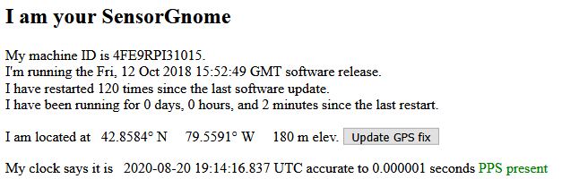
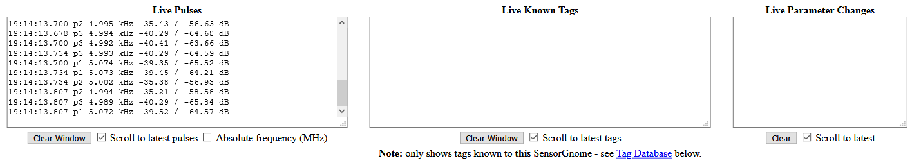
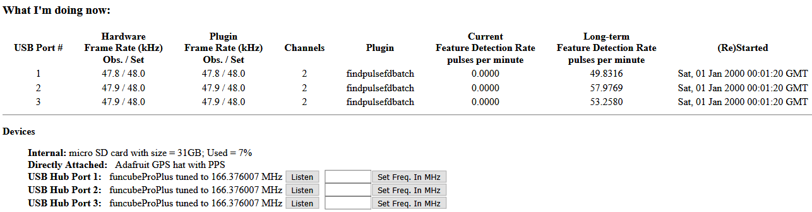

# The Web Interface

The Web Interface is where you can check the live status of your SensorGnome, to ensure that all the components are present and running as they should. As such, it’s a crucial part of any site visit, and checking it should be **the first and last thing you do** whenever you work with your SensorGnome. 


In  order to access the Web Interface, you must first _connect to your SensorGnome_. This process is described in detail in the [previous chapter](http://docs.motus.org/sensorgnome/connecting).



If you cannot access the Web Interface, or if some of the key elements are absent, there is a good chance that the SensorGnome is not working properly. Don’t leave an SG in this condition in the field unless you have no other option \(better to leave a SensorGnome that _may not_ be working, than leave no SensorGnome at all!\).


The contents of the Web Interface is the same regardless of whether you have a BeagleBone or Raspberry Pi SensorGnome, though the layout may differ slightly depending on software version.

The Web Interface contains quite a bit of information but not everything you see here is of equal importance to the general user. The information in the top quarter of the page is most useful and we’ll go into those sections in greater detail below.

## Summary

The **machine ID** is the unique serial number generated by each SG. We can see that this is a Raspberry Pi based SG because the letters “RPI” are found in the middle of the machine ID; a BeagleBone based SG would have the letters “BB” or “BBK” in the middle of the machine ID. The machine ID is essentially the same as the SensorGnome receiver serial number, only that it lacks the “SG-” in front. When viewing this receiver on the “Manage Receivers” page of the Motus website, or in data downloaded via the R package, it would be represented as “SG-4FE9RPI31015.”

Below that is the **software version** that the SensorGnome is running. This SG is running the 2018-10-12 RPI Software, which as of 2021-01-22 remains the most up-to-date full software version. Note that software patches, such as the CTT compatibility patch, will _not_ show up here.

The SensorGnome keeps track of when and how often it reboots, and keeps an internal **reboot odometer** that increments each time. When you first arrive at a SG in the field, you _hope_ to see that the SG has been running for a long period prior to your arrival, and that it has not rebooted very often during that period. It’s not necessarily a problem if you see that the SG recently rebooted prior to arrival, or that it has rebooted many times since the last visit, but it does potentially point to issues with a power supply, wiring, or perhaps gradual hardware failure.

Finally, the **GPS location and time** are displayed. Time is displayed in UTC/GMT time so there is a good chance it will be offset from your local time zone. In addition to logging the precise location of the receiver, the GPS also has a role in keeping time. Whenever an SG reboots, the internal clock will reset to 2000-01-01 and start counting from there. It is the GPS that corrects this to the proper current so that accurate timekeeping is maintained. Sometimes when a receiver is found to be recording data when the time and/or location are not properly set, it may be possible retroactively correct them. But often, any data recorded during this period will be lost. Therefore it is critical to confirm the status of these during site visits.


Do not leave an SG in the field if you do not see the correct time \(in UTC/GMT time zone\) and GPS location. Even the SG is collecting data, the detections will be of little use without the time and location.


## Pulses and Tags pane

The **Live Pulses** pane will show all radio pulses detected by the receiver in real time. Unless you have a test tag on hand this is most likely just to be background radio noise. Background radio noise is a common occurrence and most sites will show at least something here. But the amount of activity will vary quite; some stations are so “noisy” there is a steady stream of pulses coming in, whereas others may go minutes or even days without detecting pulses. The dongle that detected the pulse is also printed to the screen. The presence of pulses can help you confirm that your receiver and all dongles are functioning, but the absence of pulses isn’t all that informative.

The **Live Known Tags** pane will show the actual tag ID of any Lotek Nanotags that the receiver detects in real time. However, it’s important to remember that the SG does not have access to the full tag database on the Motus server; it only knows about the tag database that has been loaded locally onto the receiver. By default, only 2 tags are loaded \(the list is visible in the panel at the bottom of the Web Interface\). This section will also display CTT LifeTags/ PowerTags the receiver detects \(assuming the receiver has the CTT compatibility patch installed as well as CTT dongles\). There is no need to load a tag database onto the SG for CTT tags as a compatible receiver will recognize any tag IDs, including false positives, where random radio noise resembles an actual tag ID.

These panes will only show up if a recognized dongle is plugged in. If you know your dongles are plugged in, and you do not see this page, there is either a problem with the dongle\(s\), with one of the USB connections, or something else is preventing the SG from recognizing the dongles. Adjusting the connections, as well as rebooting the SG may help. The SG generally will recognize a dongle if it is hot-plugged \(plugged in while the SG is running\) but it’s best to plug the dongles in while the SG is off, and then power it on when all the peripherals attached.

## What I'm Doing Now and Devices panes

The **What I’m doing now** section displays important information about the dongles connected. You should see each of the dongles \(e.g. FUNcube dongles\) in these two sections. Also note the frame rate and frequency. The frame rate should be 48 and the frequency should match your local region \(166 MHz in the Western Hemisphere, 150.1 in Europe, and 151 MHz in Australia\). 

CTT dongles \(434 MHz worldwide\) will only be shown in the lower section when plugged in; they will not be displayed in the top section, whereas FUNcube dongles should be displayed in both sections.

You’ll also see the amount of storage space that has been filled on the MicroSD card. In the example above, only 7% of the nominal 32 GB has been used. In normal operating conditions it will take multiple years to fill up a 32 GB card with data, but it’s important to keep an eye on.

Raspberry Pi SGs only save detection data on the MicroSD card as they have no internal storage. BeagleBone SGs do have internal memory; this is what the SG software is installed on. However in most cases, a MicroSD card is used to store the detection data since the BB only has 2GB or 4GB of internal storage. There are situations where the BB SG does not recognize the MicroSD card and will save detection data to the internal memory. In these cases, you will see the storage reported as 2 GB or 4 GB, depending on how much onboard storage that particular SG has.


It's a good idea to get in the habit of taking a photo or screenshot of the Web Interface prior to finishing up at a station. This is very useful as a record of visits, and as a reference for the state of the station over time.


